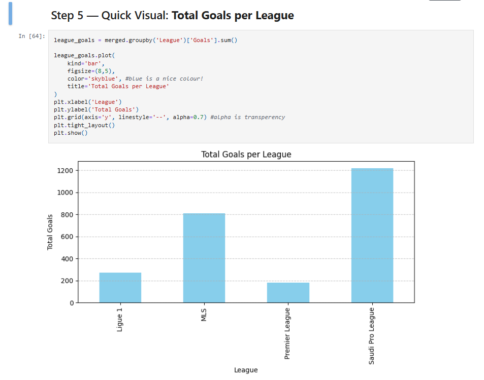
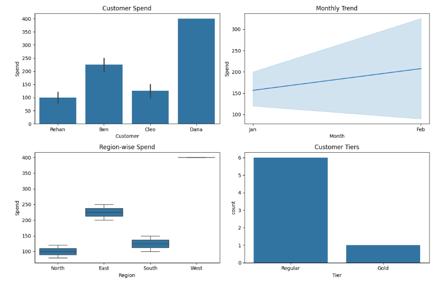

# 🧠 Warpath28: Week 1 Recap – *Foundations of a Data Analyst*  
🔥 **Days 1–6 Complete** | 📅 **Recapped on Day 7**  
**Momentum over perfection. Depth over quantity. This is the proof of work.**

---

## Projects Built:

### 🟡 Day 1–2: **Heatwave Analyzer**  
**Description:**  
Simulates daily temperature data over 60 days. Analyzes weekly averages, identifies heatwaves, and detects sudden spikes using NumPy.

**Skills Covered:**
- `reshape()`, `mean()`, `where()`
- `argmax()`, `unravel_index()`
- `diff()` for time-series deltas

---

### 🟡 Day 3: **Player Stats Analyzer**  
**Description:**  
Built a football player dataset and performed advanced filtering, mapping, and sorting.

**Skills Covered:**
- Boolean filtering & sorting  
- `.apply()` with lambda  
- `.map()` for dictionary-based mapping  
- Column dropping & index manipulation

---

### 🟡 Day 4: **Football Club Analyzer**  
**Description:**  
Merged and cleaned player + league tables. Segmented players into tiers, grouped by league, and built the first Matplotlib visual.

**Skills Covered:**
- Handling missing values: `fillna()`, `dropna()`  
- Merging: `merge()`, `concat()`  
- Grouping: `groupby()` + `agg()`  
- Visuals: `.plot()` with Matplotlib

---

### 🟡 Day 5: **Customer Spend & Loyalty Insights**  
**Description:**  
Worked with simulated e-commerce data to discover top spenders, frequency patterns, and create customer loyalty tiers.

**Skills Covered:**
- Categorical and numeric cleaning  
- `.apply()` for dynamic column creation  
- Grouped spend summaries  
- Seaborn/Matplotlib dashboard (`lineplots`, `countplots`, `boxplots`)

---

### 🟡 Day 6: **Cleaning, Categorizing, & Visualizing**  
**Description:**  
Handled edge-case cleaning (like “23 years old”, “--”, “unknown”), converted numeric into categorical groups (`pd.cut()`), and explored barplots + heatmaps to show trends.

**Skills Covered:**
- Cleaning numeric/categorical with `.apply()`  
- Binning with `pd.cut()`  
- `sns.heatmap()`, `sns.barplot()`  
- Visual storytelling through CLV trends & segmentation

---
## Project Snapshots

### 🟢 Football Club Analyzer

---
### 🟢 Customer Spend & Loyalty Dashboard

---
## Core Skills Unlocked This Week

✅ **NumPy:** `reshape`, `where`, `unravel_index`, `diff`  
✅ **Pandas:** `filtering`, `apply()`, `map()`, `merge()`, `groupby()`, `agg()`, `cut()`  
✅ **Visualization:** Matplotlib, Seaborn basics, barplots, heatmaps, countplots  
✅ **Error handling:** Debugged `KeyErrors`, `.where` misuse, and type errors  
✅ **Clean coding habits:** Using `inplace`, assigning summaries to variables, writing reusable functions  

---

## What I Learned *(from My POV)*

> *- At first, it felt like I was just following tutorials or doing things I already did before. But once I started creating **my own functions**, handling **real-world dirty data**, and debugging mistakes like a detective — it hit different.  
This isn't about just writing Pandas code. It's about understanding what each line **really does** and how it affects your dataset.*

Mistakes? Plenty. But I documented every one. Because next time — I won’t repeat them.  
I didn’t chase perfect days. I chased *consistency*, *reasoning*, and *intuition*.

---

## Thought Process & Reflections

> *- This week taught me the difference between just using a library — and **thinking like an analyst**.  
I learned when to reach for `.apply()` vs `.replace()`, how to categorize garbage entries, when to group, when to visualize, and how to debug like a surgeon.  
There were late nights, wrong graphs, and a few "OH I DIDNT SAVE IT?" moments. But I pushed through.*

Was it a good week?  
**100% Yes.** Because I ended it stronger, smarter, and still hungry for more.

---

## What’s Next – Week 2 Incoming...

- Diving into **time series basics**, **multi-table merging**, and **dashboard polish**, (**or maybe some uncharted water that will intrest me!**)
- Learn `.pivot_table()`, custom aggregations, and export visual dashboards  
- Get more comfortable with **business-style storytelling** using real insights  
- And of course — keep shipping **every single day**  

---

> *“Slipping ≠ stopping. I’m still here. Still building. Still showing up.”*  
**Week 1 done.  
Week 2 — we go harder.**

**– Rehan**
